# Building a custom video search experience using Azure Video Indexer, Azure Machine Learning and Azure Cognitive Search

[Azure Video Indexer](https://docs.microsoft.com/en-us/azure/media-services/video-indexer/) (AVAM) is an Azure service
designed to extract deep insights from video and audio files, including items such as transcripts, identifying faces and
people, recognizing brands and image captioning amongst others. The output of Azure Video Indexer can then
be indexed by [Azure Cognitive Search](https://azure.microsoft.com/en-us/services/search/) (ACS) to provide a rich
search experience to allow users to quickly find items of interest within the videos.

The above scenario works well but what if customers want to search on items of interest that are not extracted by Video
Indexer? Or what if they want to search on custom terms that are not found in the extracted insights? This solution will
enable exactly these scenarios by using an [Azure Machine Learning](https://azure.microsoft.com/en-gb/services/machine-learning/)
(AML) custom machine learning model trained using the new [Data Labelling](https://docs.microsoft.com/en-us/azure/machine-learning/how-to-create-labeling-projects)
AutoML Vision solution.


*Figure 1 – Search results showing snippets of video scenes that match the query "Doberman"*

## Solution Overview

The following describes the high level process for this solution:

* Using the [Data Labelling](https://docs.microsoft.com/en-us/azure/machine-learning/how-to-create-labeling-projects)
functionality of AML, label images that are to be searched for. Once enough images have been classified across the
AutoML process, AML will train the best model for the data.  
* The Orchestrator [Logic App](https://azure.microsoft.com/en-gb/resources/videos/introducing-azure-logic-apps/) will
poll storage for new media files and when a new file is uploaded, it will then run the Indexer [Logic App](https://azure.microsoft.com/en-gb/resources/videos/introducing-azure-logic-apps/)
as a child process and will wait until it completes.
* The Indexer [Logic App](https://azure.microsoft.com/en-gb/resources/videos/introducing-azure-logic-apps/) will invoke
the AVAM process to extract the insights and once completed, invokes a Parser WebApp to extract intervals and the
KeyFrames identified in the intervals and restructures the AVAM output. It will then run the Classifier Logic App
* The Classifier [Logic App](https://azure.microsoft.com/en-gb/resources/videos/introducing-azure-logic-apps/) will take
the restructured AVAM output and download the KeyFrame thumbnails for the video being processed. Each KeyFrame thumbnail
will be sent to the Classifier WebApp running the AML model and predict the label for the image. This will then be added
to the AVAM Output. The Classifier WebApp takes the AML ```EXPERIMENT_NAME``` as one of its input parameters. At the
startup event of the Classifier WebApp (implemented with [FastAPI](https://fastapi.tiangolo.com/)), AML will be queried
to download the latest best performing model. This complements the AML Data Labelling functionality where the model is
retrained when new data is labelled.
* The AVAM Output will be uploaded to blob storage which is then used as a Data Source for ACS. The ACS indexer will then
run and populate the index, ready for querying.

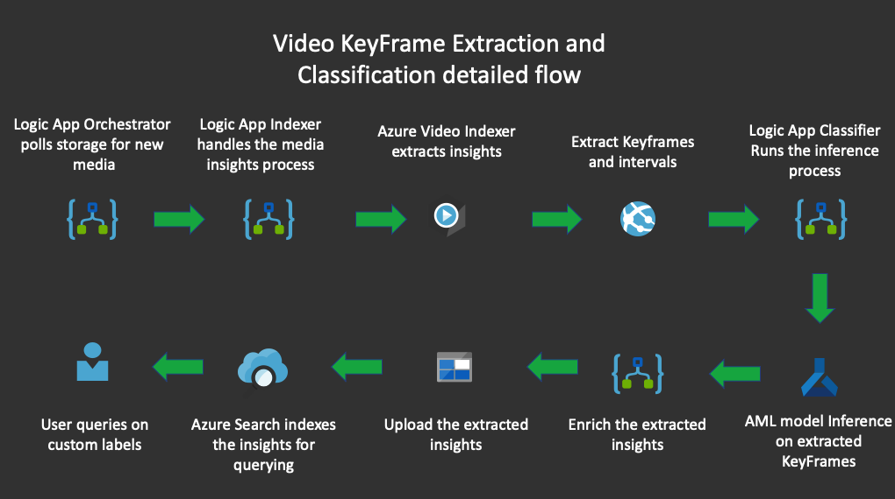

*Figure 3 – Detailed flow of the solution*

## Components of this solution

This solution will deploy the following components:

* Resource group - all resources are deployed to a resource group whose name is provided as a variable at runtime.
* Search service - this will house the search index used to search over your video content, based on insights from Video
Indexer and the augmentation services deployed.
* Storage accounts and logic apps - one storage account to back your Azure Video Indexer workspace (name prefix
`videoindexerstorage`), another to contain input media and Azure Video Indexer outputs (name prefix `generalstorage`). The
logic apps are at this stage placeholder resources whose workflow is defined by a later ARM deployment. The logic apps
deployed include:
  * An "Orchestrator" logic app provides the option of listening to a storage container (default name `media`) for input
  media and automatically running new videos through the indexing process.
  * An "Indexer" logic app implements the main insights extraction process using Azure Video Indexer, converting the results
  for use as an Azure Cognitive Search index.
  * A "Classifier" logic app runs keyframe classification using a [Power Skill](https://github.com/Azure-Samples/azure-search-power-skills)
  to enrich the search index with more detailed information for content highlighted by Azure Video Indexer.
* Storage containers - one for input media, one for insights from Azure Video Indexer, one for the output of processing from
which we generate a search index (default name `scenes`).
* Media Services - from here we'll create a Azure Video Indexer account, and connect this to the other resources.
* ARM deployment - this deploys the resources described by `template.json`, which contains internal configuration
details for the logic apps, storage accounts, and API connections used for the resources to communicate.
* An [Azure Web App](https://azure.microsoft.com/en-gb/services/app-service/web/) `AMLClassifier` that runs a docker
container which contains the AML model for inferencing. This WebApp will download the latest and best performing data
labelling model available if an experiement name is provided. More on this later.
* An [Azure Web App](https://azure.microsoft.com/en-gb/services/app-service/web/) `ParserApi` that runs a docker
container which contains the ParserApi. This Api will take the AVAM input and transform the output for ACS indexing
alongside breaking the video into intervals and extracting keyFrames.
* An [Azure Cognitive Search instance](https://azure.microsoft.com/en-gb/services/search/) that will index the AVAM
enriched content for searching

## How to deploy the solution

### Requirements

To run this solution you will need:

* docker
* A provisioned Azure Container Registry
* The Azure CLI and terraform installed

### Setup

First you must make sure you can run the [Azure CLI](https://docs.microsoft.com/en-us/cli/azure/), and
[log into your Azure account](https://docs.microsoft.com/en-us/cli/azure/get-started-with-azure-cli#sign-in) with
`az login.`

Once logged in, you need to install [Terraform](https://www.terraform.io/downloads.html).

Ensure that after installation, the `terraform` command works in your preferred shell. You can do this by running
`terraform -h`.

### Provisioning the Azure components with terraform

> Note: naming collisions can occur for some of the resources deployed, so we append a random string to most of their
names. As a result, resources will be deployed with names like `generalstoragexmwnr`, i.e. with a consistent prefix e.g.
`generalstorage` between deployments.

To deploy the solution, from this directory (`deployment`), run the following:

```bash
terraform init
terraform plan
```

You will be prompted to enter:

* `Custom auth key with which to deploy the AutoML classifier power skill`. This value can be anything. Remember the value - you will need to provide it as a header for every request.
* `Key to set up for auth with the parser API`. This value can be anything.
* You will also be prompted to enter your Azure subscription ID, desired resource group name (which must be unique from your
existing resource groups), and location (the Azure region to which you want everything to be deployed). The region
`eastus` was used in testing.

Ensure that the output of `terraform plan` reflects the resources described above, then run:

```bash
terraform apply
```

#### Expected result

After Terraform reports that the apply is complete, if you navigate to your resource group, hAVAMng used the default
variables and ARM parameters, you should see the following:

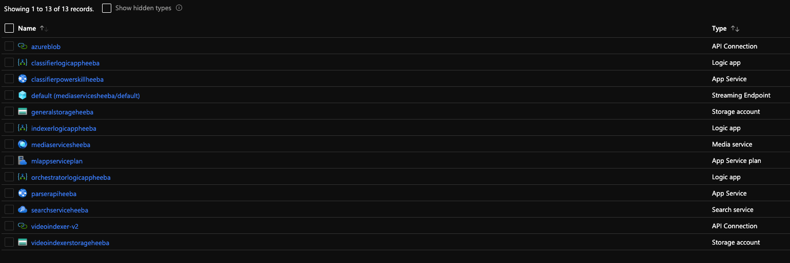

Note that some of the resources such as the larger Logic App and Media Services account might take a few minutes to
appear. As long as 13 resources are reported by Terraform, don't worry. Refresh regularly until they appear.

With all the resources in place, if you take a look at the indexer Logic App (name prefix `indexerlogicapp`),  you will
notice its workflow is intact.

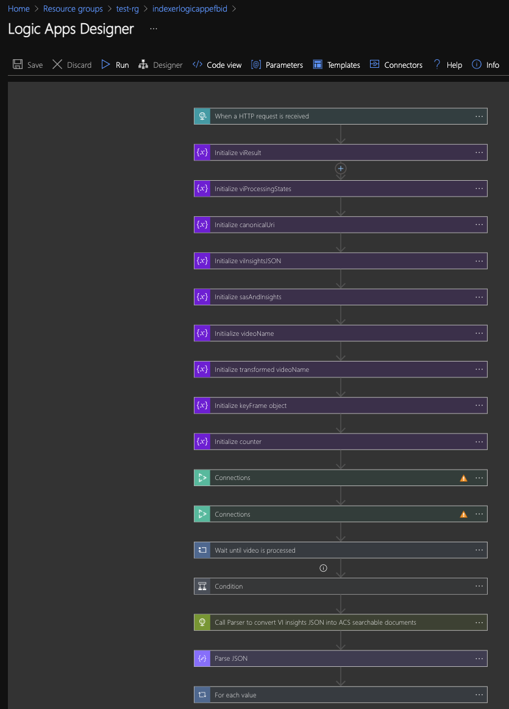

However, the API connections it uses to converse with our other services require configuration before the app can be
used.

### Manual configuration required

The following manual steps are required to be completed to make the solution functional.

#### *Azure Video Indexer Account*

First, we'll need to set up a Azure Video Indexer account linked to the Media Services Resource deployed (name prefix
`mediaservices`).

If we navigate to this resource's overview, and scroll down, there is a window entitled "Azure Video Indexer". Click the link
"[Go to Azure Video Indexer](https://www.videoindexer.ai/)".

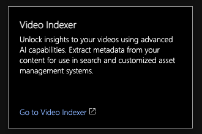

Once logged into the Azure Video Indexer portal, create a new unlimited account using the option in the user accounts sidebar,
which can be opened using the leftmost button in the top right of the portal.

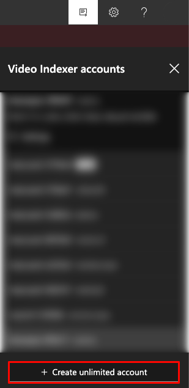

When creating the new account, select the Azure subscription and Media Services account (name prefix `mediaservices`)
used in the resource deployment.

If you see an error displayed after the account has been created, saying `There’s a problem with your connection to Azure Media Services. Update connection.`, ignore it.

Once created, go to the [Azure Video Indexer developer portal](https://api-portal.videoindexer.ai/).

Sign in using the same AAD account, and go to "Profile" in the navigation bar.

Show and copy the Primary Key of your Product Authorization Subscription to your clipboard - this is your `VI_API_KEY`.

This key will be used by our logic app to authorize its connections to your Azure Video Indexer account. With the key in your
clipboard, navigate to your deployment resource group and click on the API Connection resource `videoindexer-v2`. In the
sidebar on the left of the overview window, click on "Edit API connection".

Leave the display name the same, but paste your API key from the developer portal in the "API Key" field.

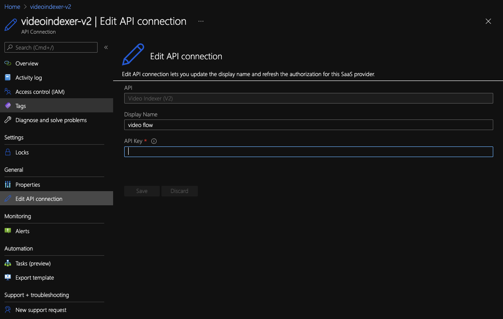

Click "save", and you should see that the Azure Video Indexer interactions in the Indexer Logic App (name prefix
`indexerlogicapp`) are now fixed and configurable.

#### *General Storage Account*

Next we need to set up the API connection used for interaction with the storage accounts deployed.

The `azureblob` API connection is intended for use with the general storage account (name prefix `generalstorage`). The
container `media` within is listened to and triggers the orchestrator logic app (name prefix `orchestratorlogicapp`)
when new videos are uploaded. Looking at this logic app's workflow in edit mode, we can see the blob connections are not
yet operational - see below.


To bring these online, navigate to the general storage account, view its access keys in the left sidebar, click
`Show Keys` and copy `key1`. Next, paste this in the `Azure Storage Account Access Key` field in the `azureblob`
API connection, in the same menu as used for for the `videoindexer-v2` connection.

You will also need to enter the general storage account's name in the correct field (name prefix `generalstorage`) -
see below.


Now, when viewing the orchestrator logic app's (name prefix `orchestratorlogicapp`) workflow in edit mode, the blob
interactions will be operational and configurable - see below.

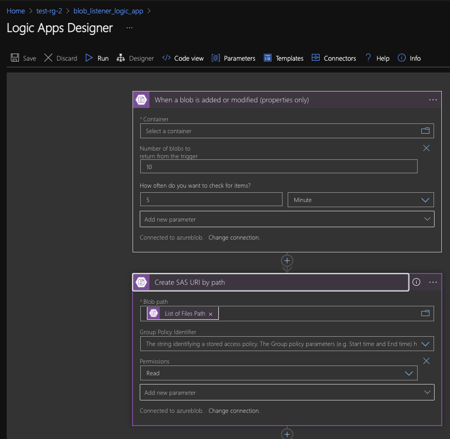

You can change configuration details such as the number of new blobs (videos) to process at a time, or the frequency
with which the app polls the `media` storage container, to suit your needs.

#### *Updating the trigger endpoint - Orchestrator Logic App*

Within the Orchestrator logic app (name prefix `orchestratorlogicapp`), in the HTTP step `Run the Indexer flow` below
this, we need to paste the trigger url of the Indexer logic app (name prefix `indexerlogicapp`).

This is the HTTP post URL in the first step of the Indexer logic app - see below.


#### *Updating the trigger endpoint - Indexer Logic App*

Within the Indexer logic app (name prefix `indexerlogicapp`), in the HTTP step `For each value` below this, expand the
following steps `For each scene` --> `Do we have a keyFrame Object` --> `Call the Classifier Child workflow` we need to
paste the trigger url of the Classifier logic app (name prefix `classifierlogicapp`).

This is the HTTP post URL in the first step of the Classifier logic app - see below.

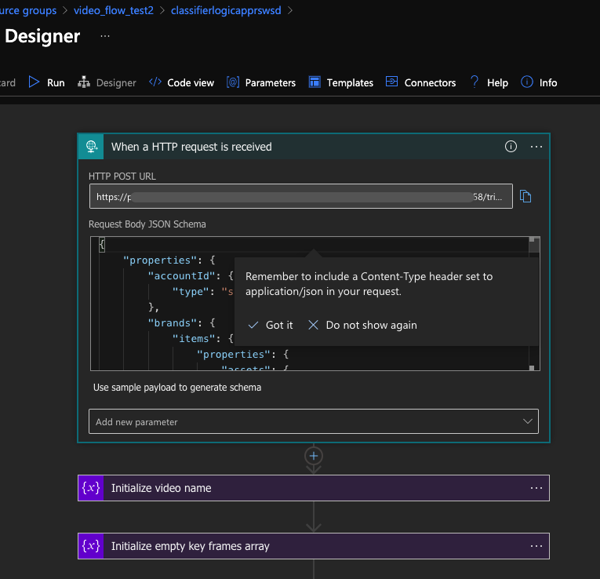

### The AML Classifier Web App

Our AML model has been deployed to a docker container which we will run as an Azure Web App.

#### The AML Classifier docker image

If you want to use a prebuilt image with the dogs model and push it to your container registry you can run:

```bash
docker pull shanepeckham/amlclassifier:v1
docker tag shanepeckham/amlclassifier:v1 [yourcontainerregistry].azurecr.io/amlclassifier:v1
docker push yourcontainerregistry].azurecr.io/amlclassifier:v1
```

By default the Azure Web App will pull the image from:

```bash
shanepeckham/amlclassifier:v1
```

#### Manually populating the AML Classifier Web App configuration

Navigate to the Classifier Web App (prefix name `classifierpowerkill`) and select `Configuration`. See below:

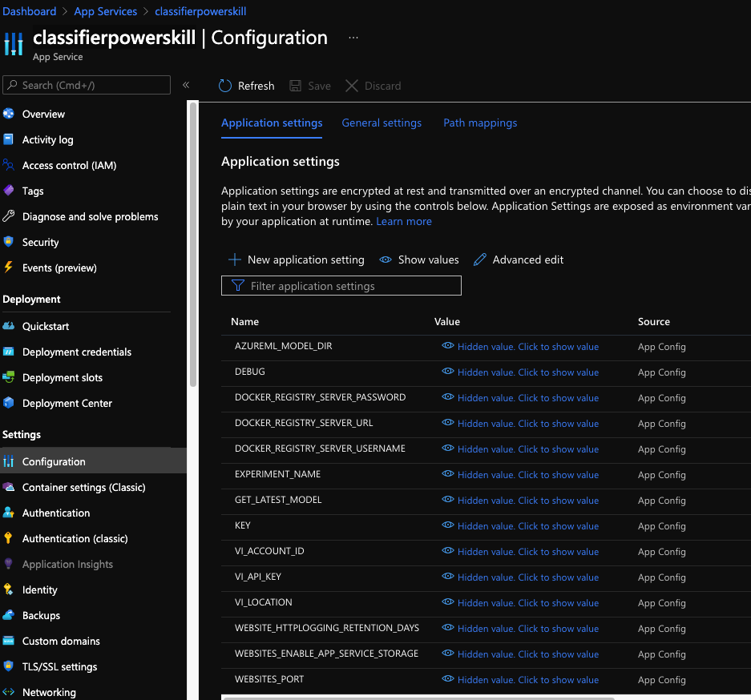

Set the following values for the respective configuration names:

```bash
AZUREML_MODEL_DIR models                                   # The container folder we mount the models to
DEBUG True                                                 #  For verbose debugging
DOCKER_REGISTRY_SERVER_PASSWORD  [your registry password]  # Only populate if you are deploying to your own registry
DOCKER_REGISTRY_SERVER_URL  [your registry url]            # Only populate if you are deploying to your own registry
DOCKER_REGISTRY_SERVER_USERNAME  [your registry username]  # Only populate if you are deploying to your own registry
EXPERIMENT_NAME [your data labelling project experiment]   # This is the experiment name associated with your data 
                                                           # labelling project
GET_LATEST_MODEL True                                      # If true, the latest best metric model will be downloaded
                                                           # from AML
KEY [your secret key]                                      # This is a secret key - only requests with this key will
                                                           # be allowed   
VI_ACCOUNT_ID  [your AVAM account id]                       # Your Azure Video Indexer Account Id
VI_API_KEY     [your AVAM API key]                          # The Primary Key from your AVAM API subscription
VI_LOCATION    [your AVAM location]                         # The region your AVAM service is deployed to
WEBSITES_PORT   5000                                       # The port the API runs on - 5000
```

After these values have been set, Save the `Configuration` and restart the Web App in the `Overview` blade. Copy the
value in the URL. It will look like similar to this `https://classifierpowerskillxxxxx.azurewebsites.net` where the
`xxxxx` will be a randomstring generated for your implementation.

#### Manually populating the Classifier Logic app with the AML Classifier Web App endpoint

Now we need to populate the the Classifier logic app (name prefix `classifierlogicapp`) parameter to be able to invoke
the Classifier Web App (prefix name `classifierpowerkill`). Click on `Parameters` in the logic app and populate the
following parameters - see below:

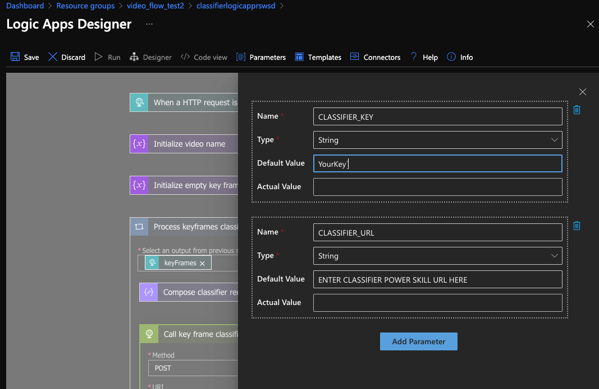

```bash
CLASSIFIER_KEY # This is the KEY value you set in the configuration for the classifierpowerskill Web App
CLASSIFIER_URL # This is the URL value you copied from the Overview blade in the Web App but add /api/extraction to it
#  e.g. https://classifierpowerskillxxxxx.azurewebsites.net/api/extraction where xxxxx is the randomstring generated
#  for your implementation
```

### The ParserAPI Web App

Our AVAM Parser has been deployed to a docker container which we will run as an Azure Web App API.

### The ParserApi docker image

If you want to use a prebuilt image and push it to your container registry:

```bash
docker pull shanepeckham/parserapi:v1
docker tag shanepeckham/parserapi:v1 [yourcontainerregistry].azurecr.io/parserapi:v1
docker push yourcontainerregistry].azurecr.io/parserapi:v1
```

By default the Azure Web App will pull the image from:

```bash
shanepeckham/parserapi:v1
```

#### Manually populating the ParserAPI Web App configuration

Navigate to the parserapi Web App (prefix name `parserapi`) and select `Configuration`. See below:

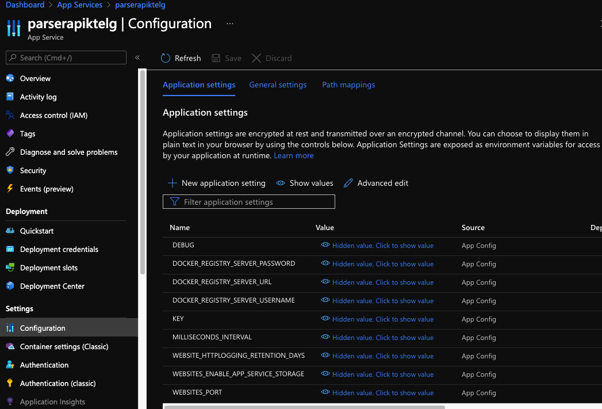

Set the following values for the respective configuration names:

```bash
DEBUG True                                                 #  For verbose debugging
DOCKER_REGISTRY_SERVER_PASSWORD  [your registry password]  # Only populate if you are deploying to your own registry
DOCKER_REGISTRY_SERVER_URL  [your registry url]            # Only populate if you are deploying to your own registry
DOCKER_REGISTRY_SERVER_USERNAME  [your registry username]  # Only populate if you are deploying to your own registry
KEY [your secret key]                                      # This is a secret key - only requests with this key will
                                                           # be allowed   
MILLISECONDS_INTERVAL  10000                               # The number of milliseconds for each interval 
WEBSITES_PORT   5000                                       # The port the API runs on - 5000
```

After these values have been set, Save the `Configuration` and restart the Web App in the `Overview` blade. Copy the
value in the URL. It will look like similar to this `https://parserapixxxxx.azurewebsites.net` where the
`xxxxx` will be a randomstring generated for your implementation.

#### Manually populating the Indexer Logic app with the ParserAPI Web App endpoint

Now we need to populate the the Indexer logic app (name prefix `indexerlogicapp`) parameter to be able to invoke
the ParserAPI Web App (prefix name `parserapi`). Click on `Parameters` in the logic app and populate the
following parameters:

```bash
viLocation # This is the VI_LOCATION value - the region of your AVAM deployment
parserUrl # This is the URL value you copied from the Overview blade in the Web App but add /api/parse to it
#  e.g. https://parserapixxxxx.azurewebsites.net/api/parse where xxxxx is the randomstring generated
#  for your implementation
webappkey # This is the KEY value you set in the configuration for the parserapi Web App
AccountID # Your Azure Video Indexer Account Id
Location # Ignore this parameter 
augmentationURL # Ignore this parameter
```

See below:

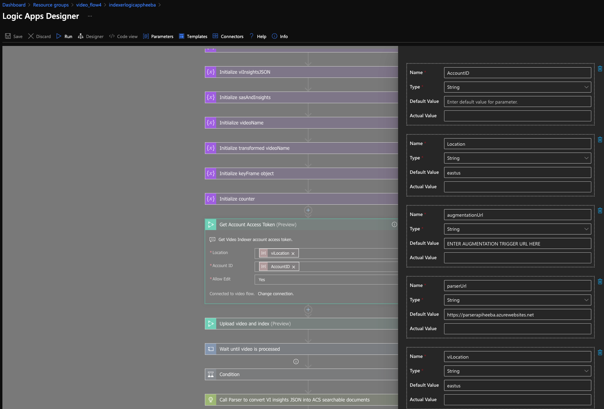

### Data

This solution uses the [Stanford Dogs dataset](http://vision.stanford.edu/aditya86/ImageNetDogs/)

Below is a full working example that you can get working end to end on sample data.

### How to test the solution

The solution ships with a pre-trained model that has been trained of five breeds of dogs in the [Stanford Dogs dataset](http://vision.stanford.edu/aditya86/ImageNetDogs/), namely:

* Airedale
* Doberman
* Rottweiler
* Afghan
* African Wild Dog

The solution triggers when a new media file is uploaded to storage, thus in order to test upload a video that features
any of the above-mentioned dog breeds. Once the Orchestrator, Indexer and Classifier processes have completed, run the
ACS Indexer in order to be able to search the video for scenes for the respective dog breeds, see below.

From this point, uploading video files to the container `media` in the general storage account should start the indexing
and insights extraction process, with both the orchestrator and then indexer logic apps running after your chosen polling interval has elapsed. You can view progress by going to the **Overview** page for the Orchestrator and Indexer Logic apps in the Azure Portal, and clicking the **Runs history** tab.

Note that the number of runs will be the same as the number of videos uploaded. This is how the apps scale for potentially many video uploads.

### Create the Azure Search components

Once all of the components have been provisioned and a few videos have successfully run through the solution, we can
create the ACS data source, the index and the indexer respectively.

Open the [Azure Search Utilities](notebooks/Azure%20Search%20Utilities.ipynb) jupyter notebook and run through the following steps to create our ACS components (Note: pip packages required are in [./notebooks/requirements.txt](notebooks/requirements.txt) - requires <= Python 3.8.1).

> **Alternatively**: If you want to use ML Studio, select the Python 3.8 - AzureML kernel.


#### Create the Data Source

We will point to the output blob storage folder where we load our enriched AVAM outfile files, which is named `generalstoragexxxxx` where the
`xxxxx` will is the randomstring generated for your implementation.. Run the cell
[Create the Data Source](notebooks/Azure%20Search%20Utilities.ipynb#Create-the-data-source) mapping to the output blob
storage folder.

The following parameters need to be completed within the notebook, namely:

```bash
API_KEY = ""   # Your ACS API Key
ACS_URL = "https://[your_search_instance].search.windows.net"   # Your ACS URL format https://[your ACS instance].search.windows.net
DATA_SOURCE = "dogs-videos-datasource"  # The name for your data source
STORAGE_CONNECTION_STRING = ""  # The blob storage connection string
CONTAINER_NAME = "scenes" # The storage container name where the AVAM output has been uploaded
```

#### Create the Index

Now we can create the ACS Index, run the cell [Create the Index](notebooks/Azure%20Search%20Utilities.ipynb#Now-we-create-the-index). The following parameter can be set to your own preferred name:

```bash
INDEX_NAME = "dogs-videos-index"  # The name for the index
```

#### Create the Indexer

Now we are ready to run the Indexer to test our queries. Run the cell [Now we create the Indexer](notebooks/Azure%20Search%20Utilities.ipynb#Now-we-create-the-indexer). The following parameter can be set to your own preferred name:

```bash
INDEXER_NAME = "dogs-videos-indexer"  # The name of the indexer
```

### Run a query in the sample UI

This solution ships with a sample UI to search your videos, open the file [AzSearch.html](ui/AzSearch.html) in an editor
and populate the following values:

```javascript
    // set the Azure Video Indexer variables here
    var viLocation = "";   // The region your AVAM service is deployed to
    var viAccountId = "";  // The AccountId of your AVAM service
    var viKey = "";        // The Primary Key from your AVAM API subscription
    // set the azure search variables here
    var azureSearchIndexName = "";  // The name of your ACS Index
    var azureSearchQueryKey = "";  // The API key of your ACS service
    var azureSearchServiceName = "";  // The name of your ACS service
```

> **Reminder**: You can get the AVAM primary key from the [Azure Video Indexer developer portal](https://api-portal.videoindexer.ai/), go to "Profile" in the navigation bar.

Lastly, you need to enable CORS on the index in order to be able to use the sample UI. Navigate to your ACS instance,
and on the Overview blade select your ACS index, select CORS and set the value to `All` or `Custom` for your domain, see
below:


Once saved, you can run a query against a dog breed to see the results - see below:

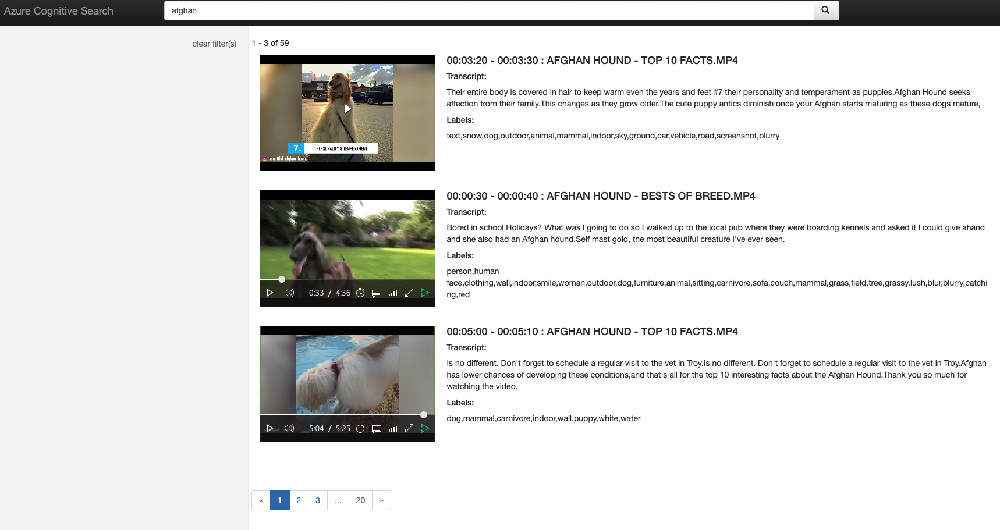

All done, phew!
